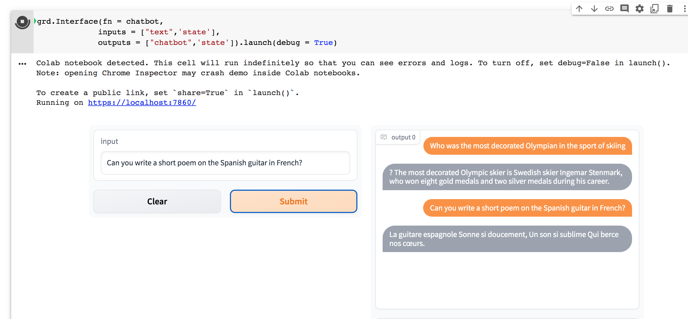
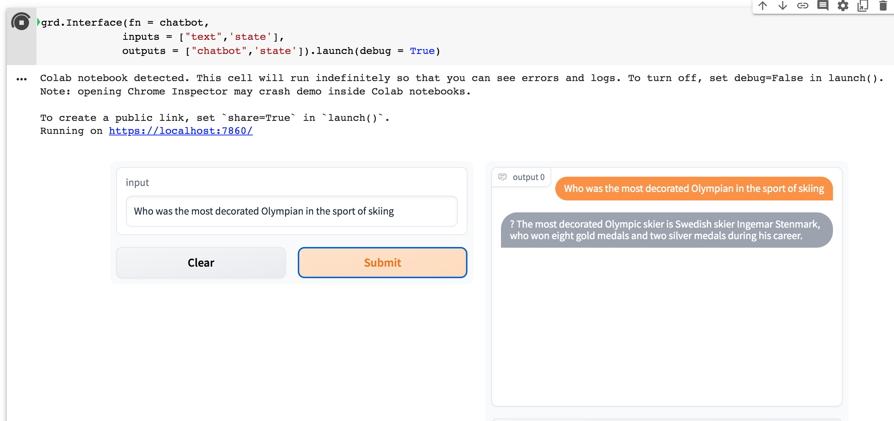

# ChatGPT

Open AI's ChatGPT based Chatbot using Python and Gradio 

OpenAI has trained remarkable language models that are quite impressive at understanding and generating text. This is a short demo of how OpenAI's API provides access to these models and how they can be used to solve tasks involving language processing. 

### Made using 

### Outputs

#### Disclaimer
This project is not affiliated with OpenAI in any way. Use at your own risk. I am not responsible for any damage caused by this project. Please read the OpenAI Terms of Service before using this project.

