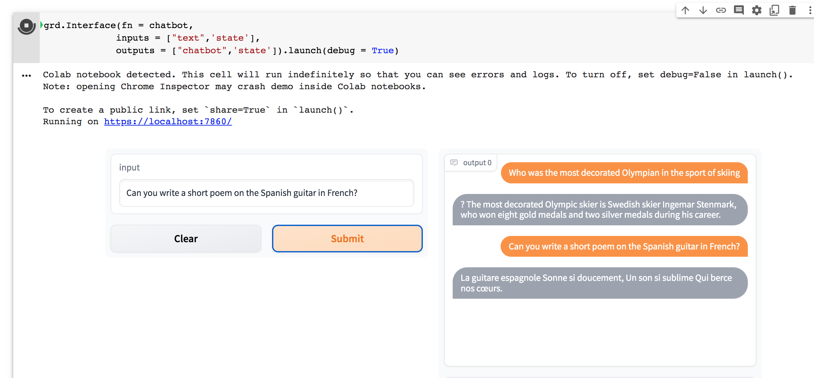
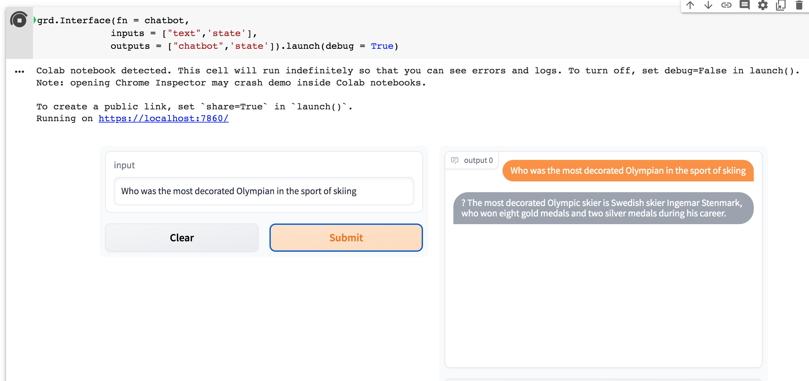
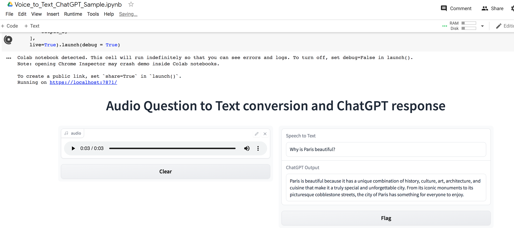

# ChatGPT

Open AI's ChatGPT based Chatbot using Python and Gradio 

OpenAI has trained language models that are quite impressive at understanding and generating text. This is a short demo of how OpenAI's API provides access to these models and how they can be used to solve tasks involving language processing. 

Interested in learning more? [See this Intro series ->](https://github.com/ginobaltazar7/66daysofdata/tree/master/GenAI/free_courses/Applied_LLMs_Intro)

### Open in Colab

#### ChatGPT_Sample

#### Voice_to_Text_ChatGPT_Sample

### Made using 

### Support Me

If you like my work consider supporting me!

### ChatGPT Outputs

#### ChatGPT_Sample

#### Voice_to_Text_ChatGPT_Sample

#### Disclaimer
This project is not affiliated with OpenAI in any way. Please use at your own risk and we are not responsible for any damage caused by the sample code in this repo. Please read the OpenAI Terms of Service.

